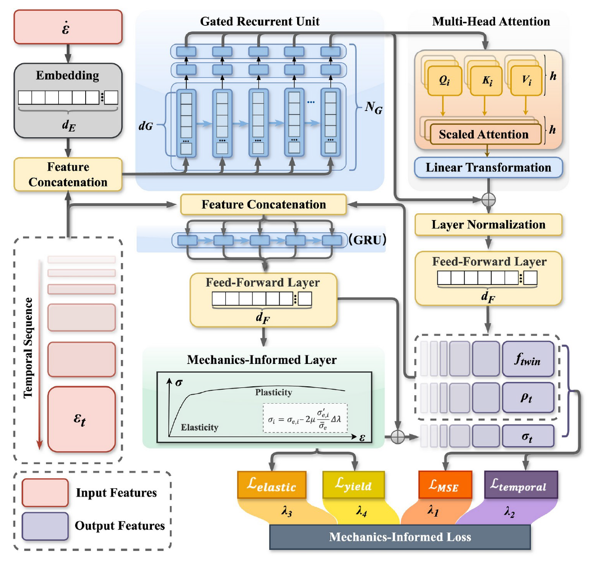

# MIDLCM: Mechanics-Informed Deep Learning Constitutive Model

A mechanics-informed deep learning constitutive model for sequential prediction of strain rate-dependent behavior and microstructural evolution.

**Paper:** *A mechanics-informed deep learning constitutive model for sequential prediction of strain rate-dependent behavior and microstructural evolution*

---

## Overview

MIDLCM integrates deep learning with classical mechanics principles to simultaneously predict macroscopic stress responses and microstructural evolution (dislocation density and twin volume fraction) under varying strain rates. Unlike conventional DL constitutive models that focus solely on stress-strain mapping, MIDLCM explicitly tracks internal state variables, providing mechanism-level interpretability.

<p align="center">
  
</p>
<p align="center">Figure 1 Architecture</p>
### Key Features

- **Multi-output prediction**: Simultaneously predicts stress evolution, dislocation density, and twin volume fraction
- **Wide strain rate coverage**: Validated across strain rates from 10<sup>-4</sup> to 5000 s<sup>-1</sup>
- **Mechanics-informed design**: Integrates J2 elasto-plastic theory as a differentiable regularization layer
- **Computational efficiency**: ~24,000x speed-up over EVPSC crystal plasticity simulations
- **Extrapolation capability**: Accurate predictions at strain rates outside the training set

## Architecture

MIDLCM comprises five key components:

| Component                       | Role                                                         |
| ------------------------------- | ------------------------------------------------------------ |
| **Embedding Layer**             | Transforms scalar strain rate into high-dimensional representation |
| **GRU (Gated Recurrent Unit)**  | Captures history-dependent deformation behavior              |
| **Multi-Head Attention (MHA)**  | Models cooperative interactions among deformation mechanisms |
| **Feed-Forward Networks (FFN)** | Maps latent features to microstructural descriptors and stress |
| **Mechanics-Informed Layer**    | Enforces elasto-plastic consistency via differentiable J2 flow theory |

### Mechanics-Informed Loss Function

The training objective combines four terms:

$$\mathcal{L} = \lambda_1 \mathcal{L}_{\text{MSE}} + \lambda_2 \mathcal{L}_{\text{temporal}} + \lambda_3 \mathcal{L}_{\text{elastic}} + \lambda_4 \mathcal{L}_{\text{yield}}$$

where $\lambda_1 = 1.0$ and $\lambda_{2-4} = 0.1$.

## Dataset

Training data is generated using the calibrated EVPSC (Elasto-Visco-Plastic Self-Consistent) crystal plasticity model for **CrFeNi medium-entropy alloy**:

- **Material**: CrFeNi FCC alloy (5000 grains, 90% FCC + 10% BCC)
- **Loading**: Biaxial tension under plane stress conditions
- **Strain rates**: 0.001/s, 0.1/s, 10/s, 1000/s, 3000/s, 5000/s
- **Total cases**: 756 (across 6 strain rates, multiple loading angles, 3 crystallographic planes)
- **Train/Test split**: 4:1 ratio (case-based splitting)
- **Sequence length**: 100 time steps (max equivalent strain = 0.16)

## Installation

### Requirements

- Python 3.8+
- PyTorch 2.0.0+
- CUDA 11.8 (for GPU acceleration)

```bash
pip install torch numpy pandas scipy scikit-learn joblib matplotlib transformers
```

## Project Structure

```
MIDLCM/
├── model.py              # Model architecture (GRU + MHA + Mechanics-Informed Layer)
├── train.py              # Training pipeline with custom loss functions
├── EVPSCdataset.py       # Dataset class (data loading & preprocessing)
├── EVPSCdataset1.py      # Dataset class (loading preprocessed data)
├── models/               # Saved model checkpoints
└── README.md
```

## Usage

### 1. Data Preparation

First, preprocess the EVPSC simulation data:

```python
from EVPSCdataset import EVPSCDataset

path = 'path/to/your/data/'
dataset = EVPSCDataset(path=path, train=True)
```

This will:

- Load CSV files from the EVPSC simulation results
- Apply logarithmic transformation to dislocation densities and strain rates
- Standardize all features (zero mean, unit variance)
- Save scaler objects for inverse transformation
- Split data into training/testing sets (4:1 ratio)

### 2. Training

```python
from torch.utils.data import DataLoader
from EVPSCdataset1 import EVPSCDataset
from train import EVPSCTrainer

# Load preprocessed data
train_dataset = EVPSCDataset(path=path, train=True)
val_dataset = EVPSCDataset(path=path, train=False)

train_loader = DataLoader(train_dataset, batch_size=64, shuffle=True)
val_loader = DataLoader(val_dataset, batch_size=32)

# Train
trainer = EVPSCTrainer(train_loader, val_loader)
best_val_loss, best_mape, best_mae = trainer.train(
    hidden_dim=256,
    num_layers=2,
    embedding_dim=2,
    num_heads=4,
    fc_dim=128
)
```

### 3. Inference

```python
import torch

model = torch.load('models/model_best_complete.pth')
model.eval()

with torch.no_grad():
    # x: strain history (batch, seq_len, 6)
    # rate: log strain rate (batch,)
    pred_micro, pred_stress = model(x, rate)
    # pred_micro[:,:,0] -> dislocation density
    # pred_micro[:,:,1] -> twin volume fraction
    # pred_stress -> stress components (3)
```

### 4. Attention Visualization

```python
pred_micro, pred_stress, attn_weights = model(x, rate, return_attention=True)
# attn_weights: (batch, seq_len, seq_len) attention heatmap
```
